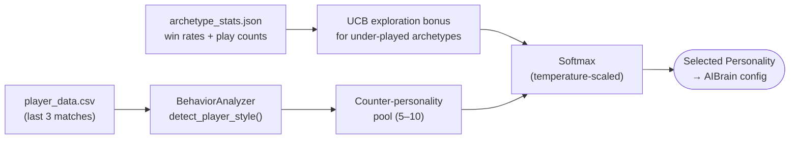
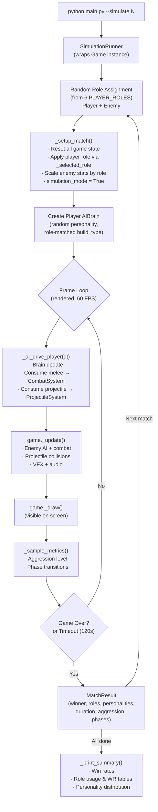

# AI Learning Opponent

> A real-time adaptive combat AI framework built inside a 2D fighting simulation using Pygame.

---

## Overview

AI Learning Opponent is a real-time adaptive combat AI framework
built inside a 2D fighting simulation.

The project explores behavioral modeling, dynamic difficulty adjustment,
state-based decision systems, and reinforcement-inspired personality selection
within a deterministic offline environment.

## Why This Project?

Traditional enemy AI relies on static behavior trees or scripted patterns.
This project experiments with:

- Real-time player behavior profiling
- Strategy adaptation across matches
- Phase-based escalation logic
- Competitive rubber-banding without feeling unfair
- Modular AI architecture suitable for reuse

The game serves as a controlled simulation environment for testing adaptive AI design.

---

## System Architecture

The codebase is organized into four layers: **entities**, **systems**, **AI**, and **utilities**. Each layer only depends on layers below it; the top-level `main.py` orchestrates them through a state-driven game loop.

```mermaid
graph TB
    subgraph Entry["Entry Point"]
        Main["main.py · Game"]
    end

    subgraph Entities["Entities Layer"]
        Player["Player\n(role_config, ability, stamina)"]
        Enemy["Enemy\n(personality, ai_controller)"]
        Character["Character\n(base sprite)"]
    end

    subgraph Systems["Systems Layer"]
        Combat["CombatSystem"]
        Projectile["ProjectileSystem"]
        Ability["AbilitySystem\n(6 role abilities)"]
        VFX["VFXSystem"]
        Stamina["StaminaSystem"]
        Buff["BuffManager"]
        Health["Healthbar"]
        CharSelect["CharacterSelectScreen"]
        PVP["PVPManager"]
    end

    subgraph AI["AI Layer"]
        Brain["AIBrain\n(FSM orchestrator)"]
        Intent["CombatIntentSystem"]
        Aggression["AggressionSystem"]
        Phase["PhaseSystem"]
        Learner["AdaptiveLearning"]
        Styles["AttackStyleSystem"]
        Balancer["DifficultyBalancer"]
        Desp["DesperationMode"]
        BuildAdapt["BuildDifficultyAdapter"]
        Personality["Personality Selector\n(softmax + UCB)"]
        Analyzer["BehaviorAnalyzer"]
        Persist["Persistence\n(archetype_stats.json)"]
    end

    subgraph Utils["Utilities"]
        Audio["AudioManager\n(procedural SFX)"]
        VFXUtil["Screen Shake / Floating Text\nHit Stop / Camera Zoom"]
        Logger["DataLogger\n(player_data.csv)"]
    end

    Main --> Player
    Main --> Enemy
    Main --> Combat
    Main --> Projectile
    Main --> VFX
    Main --> Audio
    Main --> CharSelect

    Player --> Character
    Enemy --> Character
    Player --> Ability
    Player --> Stamina
    Player --> Buff
    Enemy --> Stamina
    Enemy --> Buff

    Enemy --> Brain
    Brain --> Intent
    Brain --> Aggression
    Brain --> Phase
    Brain --> Learner
    Brain --> Styles
    Brain --> Balancer
    Brain --> Desp
    Brain --> BuildAdapt

    Enemy --> Personality
    Personality --> Persist
    Personality --> Analyzer
    Analyzer --> Logger
```



### Layer Responsibilities

| Layer | Modules | Purpose |
|-------|---------|---------|
| **Entry** | `main.py` | Game loop, state machine (`MENU → CHARACTER_SELECT → PLAYING → GAME_OVER`), event dispatch |
| **Entities** | `player.py`, `enemy.py`, `character.py` | Game actors with physics, animation, and role/stat configuration |
| **Systems** | `combat_system.py`, `projectile_system.py`, `ability_system.py`, `vfx_system.py`, etc. | Stateless services that operate on entities — damage resolution, collision, visual effects |
| **AI** | `ai_core.py`, `ai_system.py`, `phase_system.py`, `aggression_system.py`, etc. | All enemy decision-making, learning, and difficulty adaptation |
| **Utilities** | `audio_manager.py`, `helpers.py`, `vfx.py` | Procedural audio synthesis, screen-space effects, data logging |

---

## AI Decision Flow

Every frame the enemy's `AIBrain` runs an eight-subsystem pipeline that feeds into a finite-state machine. No subsystem directly controls the enemy — they each produce **modifiers** that the brain composites before making a single authoritative decision.

```mermaid
flowchart TD
    Observe["Observe Player\n(distance, HP, stamina, blocking)"]
    Learn["AdaptiveLearning\n· Pattern recognition\n· Player profile update"]
    PhaseUp["PhaseSystem\n· OBSERVE → COUNTER → \nDESPERATION → RAGE"]
    StyleUp["AttackStyleSystem\n· Blend 2 of 7 archetypes\n· Auto-rotate every 8 ± 3s"]
    BalUp["DifficultyBalancer\n· Rubber-banding\n· balance_score ∈ [-1, 1]"]
    IntentUp["CombatIntentSystem\n· attack_intent\n· aggression_level\n· defensive_bias\n· risk_tolerance"]
    AggroUp["AggressionSystem\n· Tempo mode selection\n· Punish detection\n· Combo queue"]
    DespUp["DesperationMode\n· Comeback burst\n· Rage override (HP ≤ 12%)"]
    BuildUp["BuildDifficultyAdapter\n· Counter MAGE / DEX / TANK"]

    Decide{"_decide_state()\nIntent-driven FSM gate"}
    States["FSM States\nidle · chase · attack\nretreat · block_wait\nstrafe · stunned · feint"]
    Tick["_tick_state()\nExecute movement / attack / block"]
    Output(["Pending damage / projectile\n→ consumed by main.py"])

    Observe --> Learn
    Learn --> PhaseUp
    PhaseUp --> StyleUp
    StyleUp --> BalUp
    BalUp --> IntentUp
    IntentUp --> AggroUp
    AggroUp --> DespUp
    DespUp --> BuildUp
    BuildUp --> Decide
    Decide --> States
    States --> Tick
    Tick --> Output
```



### Personality Selection (Cross-Session)

Before each match the system selects a personality using a **softmax + UCB** algorithm over historical win rates stored in `archetype_stats.json`:



### 10 Personalities

| Personality | Play Style |
|-------------|------------|
| **Berserker** | Max aggression, fastest attacks, relentless pressure |
| **Duelist** | Counter-specialist with parry combos and punish windows |
| **Coward** | Evasive, hit-and-run, minimizes damage taken |
| **Trickster** | Feints, erratic movement, dodge-heavy |
| **Mage** | Ranged projectile focus, spacing control |
| **Tactician** | Balanced, methodical, exploits openings |
| **Aggressor** | Sustained pressure, tempo control |
| **Defender** | Block-heavy, punish-oriented, patient |
| **Predator** | Relentless chase, high combo extension |
| **Adaptive** | Mirrors the player's own detected style |

---

## Simulation Mode Pipeline

The `--simulate N` CLI flag runs fully automated **AI-vs-AI** matches with random role rotation. Both sides are driven by independent `AIBrain` instances — no gameplay logic is duplicated.



### Role Rotation

Each match randomly assigns one of **6 character roles** to both sides, enabling automated evaluation of role balance:

| Role | Damage | Speed | Defense | Ability | Build Type |
|------|--------|-------|---------|---------|------------|
| **Mage** | 8 | 3 | 4 | Arcane Bolt (projectile) | MAGE |
| **Berserker** | 14 | 5 | 3 | Blood Rage (1.6× damage) | DEXTERITY |
| **Tactician** | 9 | 4 | 7 | Battle Plan (speed + damage) | BALANCED |
| **Guardian** | 6 | 3 | 10 | Iron Bastion (0.5× damage taken) | TANK |
| **Assassin** | 12 | 7 | 2 | Shadow Step (blink + invuln) | DEXTERITY |
| **Adaptive** | 9 | 5 | 6 | Evolve (scaling stats) | BALANCED |

---

## Modular Architecture

The AI system is designed around the **modifier-composition** pattern: each subsystem runs independently during the per-frame update and outputs a typed modifier struct. The central `AIBrain` multiplies these together before making a single FSM transition. This means any subsystem can be removed, replaced, or tuned without affecting the others.

```
AIBrain.update() per frame
│
├─ AdaptiveLearning.observe()       → PlayerProfile
├─ PhaseSystem.update()             → PhaseModifiers
├─ AttackStyleSystem.update()       → StyleModifiers  (blended)
├─ DifficultyBalancer.update()      → DifficultyModifiers
├─ CombatIntentSystem.update()      → aggression / intent signals
├─ AggressionSystem.update()        → tempo mode, cooldowns
├─ DesperationMode.update()         → DesperationModifiers
├─ BuildDifficultyAdapter.get()     → BuildModifiers
│
└─ Composite modifiers → _decide_state() → _tick_state() → action
```

**Key design principles:**

- **Subsystem isolation** — Each AI module has its own config dataclass, update method, and typed output. No subsystem reads another's internal state.
- **Personality-as-config** — The `Personality` dataclass parameterizes the same code paths (attack frequency, dodge probability, aggression, etc.) rather than branching on personality type.
- **Entity-system separation** — `Player` and `Enemy` are thin data holders. All logic lives in systems (`CombatSystem`, `ProjectileSystem`) or the AI layer (`AIBrain`).
- **Zero external AI assets** — All decisions are computed from first principles each frame. No pre-trained models, no lookup tables, no baked animation trees.
- **Cross-session memory** — `persistence.py` stores per-archetype win rates in JSON. The softmax selector uses these to shift personality distribution over multiple play sessions.

---

## Engineering Highlights

### Adaptive Difficulty (Rubber-Banding)

The `DifficultyBalancer` computes a continuous **balance score** from damage ratios, hit/miss rates, and defensive success. When the player is struggling (score < −0.25), the AI eases up — slower reactions, telegraphed attacks, reduced combo chains. When the player dominates (score > +0.25), the AI sharpens — tighter spacing, faster cooldowns, aggressive punishes. The transition is smoothed over time so the player never feels a discrete difficulty switch.

### Phase Escalation

`PhaseSystem` drives a four-phase combat arc: **OBSERVE → COUNTER → DESPERATION → RAGE**. Each phase multiplies aggression, cooldowns, combo chances, and feint probabilities differently. RAGE (HP ≤ 12%) triggers a cinematic slow-motion zoom and switches the enemy to a stamina-ignoring, retreat-refusing all-in.

### Procedural Audio

All 16 sound effects are synthesized at startup using numpy waveforms — sine, square, noise generators with envelope shaping. No external audio files are required. The `AudioManager` handles stereo panning based on world position, volume ducking during slow-motion, a heartbeat loop at low HP, and a choreographed death sequence (bass drop → victory/death sting).

### Attack Style Blending

The `AttackStyleSystem` simultaneously blends **2 of 7 combat archetypes** (Trickster, Analyzer, Predator, Tactician, Berserker, Mirror, Phantom) with weighted interpolation. Archetypes auto-rotate every 8±3 seconds with staleness detection, making the enemy feel varied and unpredictable across a single match.

### Perfect Parry System

`CombatSystem` tracks block-start timestamps. If the player blocks within the `PARRY_WINDOW` of an incoming attack, a **perfect parry** triggers — stunning the enemy, granting a damage multiplier, and spawning a distinct VFX flash + spark ring.

### Simulation-as-Testing

The `--simulate N` flag runs N full matches with randomized roles and personalities, collecting per-match metrics (aggression, phase transitions, duration, win rates). The rendered output makes it easy to visually inspect AI behavior at scale, while the summary tables provide quantitative role balance data.

---

## Technical Highlights

- Modular AI architecture with subsystem isolation
- Softmax + UCB personality selection with epsilon exploration
- Persistent cross-session learning (JSON store)
- Match analytics via matplotlib
- State-driven game loop (`MENU → CHARACTER_SELECT → PLAYING → GAME_OVER`)
- 6 character roles with unique abilities and stat profiles
- Procedural SFX generation (no external audio files)
- AI-vs-AI simulation runner with role rotation and metrics
- AI debug overlay (F1) showing real-time personality, phase, intent, and softmax probabilities
- Perfect parry and execution mechanics
- Offline executable packaging via PyInstaller

---

## Project Structure

```
ai_learning_opponent/
├── main.py                    # Game loop, state machine, CLI entry
├── settings.py                # All tunable constants
├── audio_manager.py           # Procedural SFX synthesis
├── keybinds.py                # Input mapping
│
├── entities/
│   ├── character.py           # Base sprite with physics
│   ├── player.py              # Player entity (role, ability, stamina)
│   └── enemy.py               # Enemy entity (personality, AIBrain)
│
├── systems/
│   ├── combat_system.py       # Damage resolution, parry, execution
│   ├── ability_system.py      # 6 role abilities (factory pattern)
│   ├── projectile_system.py   # 2D projectile spawning & collision
│   ├── vfx_system.py          # Particle / trail / flash effects
│   ├── stamina_system.py      # Stamina drain & recovery
│   ├── buff_system.py         # Timed stat modifiers
│   ├── healthbar.py           # Animated health bars
│   ├── character_select.py    # Role selection UI (2×3 grid)
│   └── pvp_system.py          # Local PVP mode
│
├── ai/
│   ├── ai_core.py             # AIBrain — central FSM orchestrator
│   ├── ai_system.py           # Personality selection (softmax + UCB)
│   ├── phase_system.py        # OBSERVE → COUNTER → DESPERATION → RAGE
│   ├── combat_intent_system.py# Per-frame intent signals
│   ├── aggression_system.py   # Tempo mode, punish detection
│   ├── adaptive_learning.py   # Real-time pattern learning
│   ├── attack_style_system.py # 7-archetype blending system
│   ├── difficulty_balancer.py # Rubber-banding DDA
│   ├── build_difficulty_adapter.py # Counter player build types
│   ├── desperation_mode.py    # Low-HP comeback + rage
│   ├── behavior_analyzer.py   # Player style detection from CSV
│   ├── persistence.py         # Cross-session archetype stats (JSON)
│   ├── simulation_runner.py   # AI-vs-AI automated matches
│   ├── data_logger.py         # Per-match CSV writer
│   └── stats.py               # Match statistics tracking
│
└── utils/
    ├── helpers.py             # Shared math / drawing utilities
    └── vfx.py                 # Screen shake, floating text, hit stop
```

---

## Getting Started

```bash
# Clone and enter the project
git clone <repo-url>
cd ai_learning_opponent

# Create virtual environment and install dependencies
python -m venv .venv
.venv\Scripts\activate        # Windows
pip install -r requirements.txt

# Run the game
python main.py

# Run AI-vs-AI simulation (e.g. 50 matches)
python main.py --simulate 50
```

## Future Improvements

- Reinforcement learning policy experiments
- Networked multiplayer mode
- AI telemetry dashboard
- Performance profiling & optimization
- Plugin-based AI module system